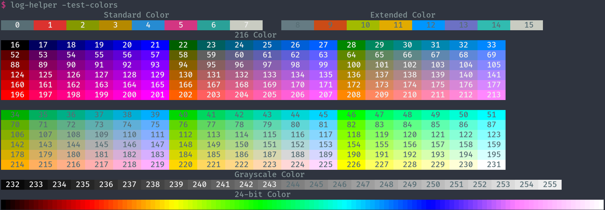

# Log Helper

`log-helper` is a tool to help read logs or other text files from a command line

## Usage

```shell
$ log-helper --help
Usage of log-helper:
  -filter
        filter unmatched lines
  -i    case insensitive
  -k    replace kubernetes IPs with names
  -logs
        run log highlighter
  -p string
        preset configuration to use (shorthand) (default "default")
  -preset string
        preset configuration to use (default "default")
  -test-colors
        test color support
```

Note: many features require 24-bit color support in the terminal to work properly. Run `log-helper -test-colors`
and ensure the output looks similar to below:



## Examples

Highlight log levels:

```shell
kubectl logs -f svc/echo | log-helper debug info warn error
# Anything matching these words (regex) will be highlighted with a unique color.
```

---

Find all IPs relevant to current Kubernetes cluster (Service IP, Pod IP, Node IP), replace them with
the name of the resource they are:
```shell
$ kubectl logs -f svc/echo | log-helper -k
"GET / HTTP/1.1" 200 - - - "-" 0 95 1 - "-" "curl/7.79.1" "echo" "echo-b56d564-zpgrd:80" outbound|80||echo.default.svc.cluster.local shell-6874dcdd7f-f4c86:38726 echo:80 shell-6874dcdd7f-f4c86:57792 - default
$ kubectl logs  svc/echo # Without log processing, we just see opaque IPs
"GET / HTTP/1.1" 200 - - - "-" 0 95 1 - "-" "curl/7.79.1" "echo" "10.244.0.10:80" outbound|80||echo.default.svc.cluster.local 10.244.0.4:38726 10.96.51.14:80 10.244.0.4:57792 - default
```

---

Highlight all numbers. When the same regex matches multiple unique values, the highlight will be the same color but different shade for each match.

```shell
$ cat log | log-helper [0-9]
```

## Configuration

Along with command line flags, a config file can be specified in `log-helper/config.yaml` under the [`UserConfigDir`](https://pkg.go.dev/os#UserConfigDir) (typically `$HOME/.config/log-helper/config.yaml`).

This can define a number of `presets`. The `default` preset always applies, while others can be activated on demand using flags. For example:

```yaml
presets:
  default:
    colors:
    - '#cb4b16'
    - '#a2ba00'
    - '#e1ab00'
    - '#0096ff'
    - '#6c71c4'
    - '#31bbb0'
    matchers:
    - regex: my-name
  istiod-xds:
    colors:
    - '#cb4b16'
    - '#a2ba00'
    - '#e1ab00'
    - '#0096ff'
    - '#6c71c4'
    - '#31bbb0'
    matchers:
    - regex: 'RDS'
    - regex: 'CDS'
    - regex: 'LDS'
    - regex: 'EDS'
    - regex: 'resources\x'
    - regex: 'size\x'
    - regex: 'node\x'
    - regex: 'cached\x'
    - regex: PUSH
    - regex: request
    - regex: XDS
```

By default, this will always highlight `my-name`. When the `--preset=istiod-xds` is added, a number of additional matches are added.

Note: `foo\x` is an alias for `(?:\s|^)foo[:=]\S+` to match key value pairs like ` key=1 foo:bar `.
